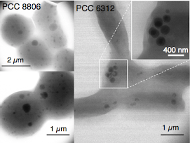
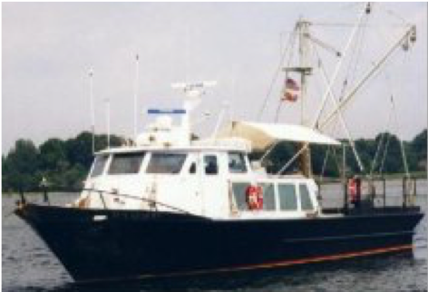
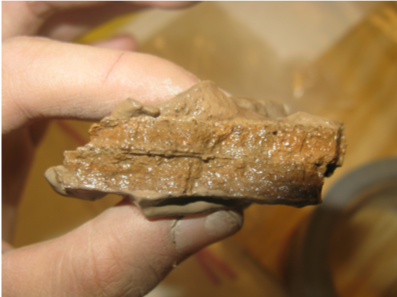
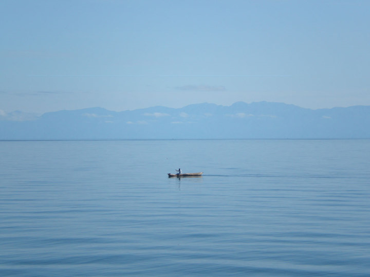

### [**Home**](README.md)  /  [**Research**](Research.md)  /  [**Teaching**](Teaching.md)   /  [**Publications**](Publications.md)  /  [**Join us**](/_pages/Joinus.md)  /  [**News**](News.md) 
---

## Current Directions and Projects 

### Sediments geochemistry and benthic-pelagic coupling

### Benthic invaders shift geochemical regimes by impacting sediments 
 The invasion of dreissenid mussels (zebra mussels and quagga mussels) in the Laurentian Great Lakes has caused dramatic changes in the ecology and water chemistry. The impacts of mussels on sediments remain unclear. We survey the lake floor of upper Great Lakes (Lakes Superior, Michigan, and Huron), characterize sediment geochemistry and mussel physiology, and investigate the impacts of mussels on  exchanges of elements at the sediment-water interface. We develop a whole-system mass-balance model to quantify the mussels' impact on ecosystem scale, and predict the geochemical trajectory of invaded systems. 

### Plankton cope with nutrient limitation using polyphosphate metabolism 
 Phytoplankton can accumulate polyphosphate (polyP), a long-chain phosphate polymer linked by high energy bounds. We study how the metabolisms of polyP can help phytoplankton survive stressful conditions, in particularly coping with nutrient limitation by reserving energy and nutrients. We use both 1) culture experiments of cyanobacteria and algae, and 2) field investigations of plankton polyP metabolisms diverse aquatic systems, including the eutrophic waters of Lake Ontario, oligotrophic Lake Superior, and marine coastal waters. 
  
  
## Past Projects 

### Tracing sources and turnover of phosphorus in the Chesapeake Bay
 Phosphorus cycling in the Chesapeake Bay is complicated by its dynamic sources and transformations. We use stable isotope tracer (phosphate oxygen isotopes) in combine with traditional geochemical techniques to trace the P sources, reactions, and biological turnover. 

### Sediments in the World's largest "freshwater sea" 
My PhD dissertation works on characterizing the sediment geochemistry of Lake Superior, the world's largest freshwater lake, and also one of the most oligotrophic waters. The work quantified sediment diagenetic rates and fluxes (of C, N, P, Fe, and S) and investigate their temporal and spatial heterogeneity, develop models to reconstruct and predict water column geochemistry, and describe fundamental mechanisms that can be applied across time and spatial scales.
Some findings include 1) Strong oxygen dynamics in carbon-poor sediments 2) modified sediment nitrogen rates and fluxes explain the accumulation of nitrate in systems experiencing oligotrophication, 3) Anammox (anaerobic ammonium oxidation) contributes significantly to nitrogen loss 4) organic sulfur supports sulfate reduction in low-sulfate environments, important implications for ancient oceans, and 5) phosphorus fluxes in deeply oxygenated sediments are controlled by organic matter mineralization.  

### Geochemical cycles in the tropical meromictic Lake Malawi (East Africa)
 The meromictic tropical Lake Malawi is one of the largest East African Great Lakes, permanently stratified and remain anoxic below 200 meters, with its biogeochemical functioning differs substantially from temperate lakes. We characterized the carbon, nitrogen, and phosphorus cycling in the water column and sediments and compiling whole-lake geochemical budgets. 

